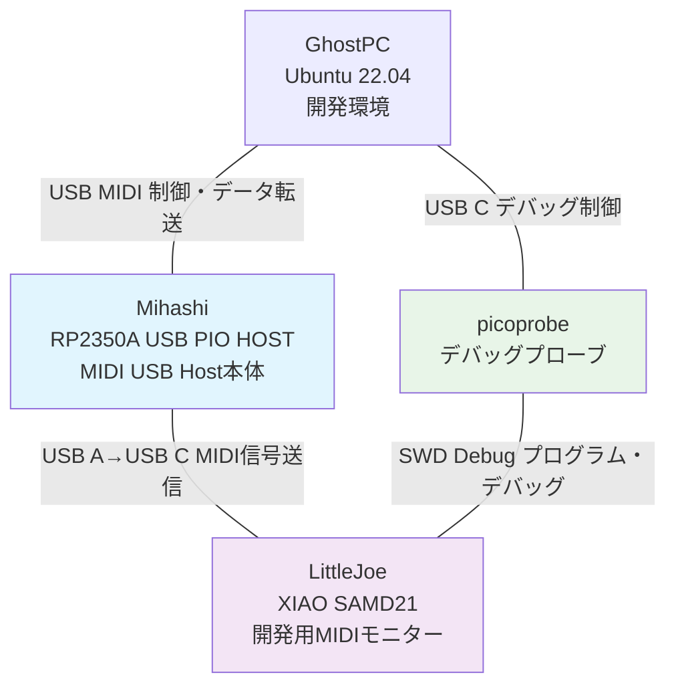

# MidiBridge Project

## プロジェクト概要

MidiBridgeは、自律開発機能を持つUSB MIDI変換システムです。3つのデバイスで構成され、Claude Code統合による夜間自動開発機能を備えています。

## システム構成



## デバイス詳細

### 🎵 Mihashi (本体)
- **ハードウェア**: Waveshare RP2350A USB PIO HOST
- **機能**: USB MIDI Host、双方向MIDI変換
- **接続**: GhostPC ←→ USB MIDI、LittleJoe ←→ USB A/C
- **開発**: 自律開発システム対応

### 🔍 LittleJoe (モニター)
- **ハードウェア**: Seeed XIAO SAMD21
- **機能**: 開発用MIDIデータモニタリング、UART変換
- **接続**: Mihashi ←→ USB C、picoprobe ←→ SWD
- **開発**: リアルタイムデバッグ対応

### 🛠️ picoprobe (デバッガ)
- **ハードウェア**: Raspberry Pi Pico (debugprobe firmware)
- **機能**: SWDデバッガ、UART通信
- **接続**: GhostPC ←→ USB C、LittleJoe ←→ SWD
- **開発**: OpenOCD + GDB統合

### 💻 GhostPC (開発環境)
- **ハードウェア**: Ubuntu 22.04 Server
- **機能**: 統合開発環境、自律開発実行
- **ツール**: Pico SDK、Arduino CLI、Claude Code CLI、Bun.sh
- **自動化**: GitHub Actions、systemd、Discord通知

## 技術仕様

| 項目 | Mihashi | LittleJoe | picoprobe |
|------|---------|-----------|-----------|
| CPU | RP2350A (150MHz) | SAMD21 (48MHz) | RP2040 (133MHz) |
| メモリ | 520KB SRAM | 32KB SRAM | 264KB SRAM |
| USB | Host (PIO) | Device | Device |
| 開発SDK | Pico SDK | Arduino IDE | Pico SDK |

## 通信プロトコル

### MIDI Data Flow
```
USB MIDI Device → Mihashi → USB A/C → LittleJoe → UART → picoprobe → GhostPC
```

### Debug Flow
```
GhostPC → picoprobe → SWD → LittleJoe (リアルタイムデバッグ)
```

## 自律開発システム

- **稼働時間**: 毎日 24:00-05:00
- **AI統合**: Claude Code による自動コード改善
- **CI/CD**: GitHub Actions + systemd
- **通知**: Discord Webhook
- **監視**: システムヘルスモニタリング

## ファイル構成

```
PicoBridge/
├── README.md                                    # このファイル
├── docs/
│   ├── Mihashi_Technical_Specification.md      # Mihashi技術仕様
│   ├── LittleJoe_Development_Guide.md          # LittleJoe開発ガイド
│   └── Autonomous_Development_System.md        # 自律開発システム詳細
├── firmware/
│   ├── mihashi/                                 # Mihashi用ファームウェア
│   └── littlejoe/                               # LittleJoe用ファームウェア
├── scripts/
│   └── autonomous_dev/                          # 自律開発スクリプト
└── diary/
    └── 2025-06-24.md                           # 開発日誌
```

## 開発状況

### 完了項目 ✅
- [x] GhostPC開発環境構築
- [x] デバイス接続確認
- [x] プロジェクト設計・文書化
- [x] GitHub同期設定

### 進行中項目 🚧
- [ ] Mihashi ファームウェア実装
- [ ] LittleJoe モニタリング機能
- [ ] 自律開発システム統合

### 今後の予定 📋
- [ ] Arduino IDE環境でのLittleJoe開発
- [ ] リアルタイムMIDIデバッグ機能
- [ ] システム全体統合テスト

## クイックスタート

1. **環境確認**
   ```bash
   # GhostPCでのデバイス確認
   lsusb  # Mihashi, picoprobeが表示されるか確認
   ```

2. **開発環境起動**
   ```bash
   cd ~/MidiBridgePico
   # 各デバイスの開発環境を起動
   ```

3. **自律開発有効化**
   ```bash
   sudo systemctl enable autonomous-dev.service
   sudo systemctl start autonomous-dev.service
   ```

## 貢献・開発

このプロジェクトは自律開発システムにより、AIが継続的に改善を行います。
手動での貢献も歓迎します。詳細は各技術文書を参照してください。

---

**Project Status**: Active Development  
**Last Updated**: 2025-06-24  
**Next Milestone**: Arduino環境でのLittleJoe実装