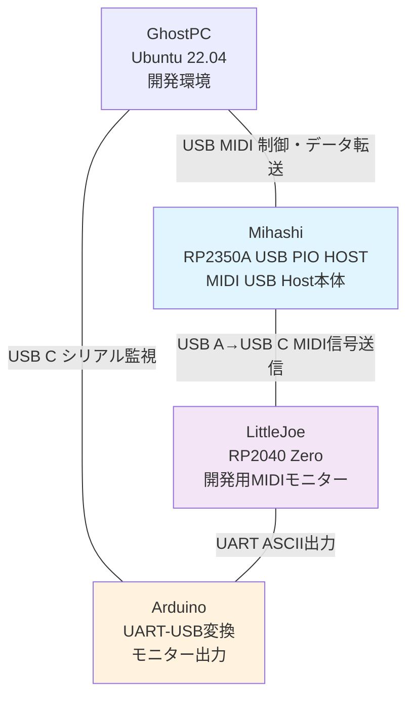

# Mihashi Dev Project

## プロジェクト概要

**Mihashi Dev Project** は、Claude Code を活用した自律開発により USB MIDI変換デバイス「Mihashi」を開発するプロジェクトです。GhostPC が夜間時間帯に自動的にコード改善・テスト・デプロイを実行し、3つのデバイスで構成されたシステムで開発・検証を行います。

## システム構成



## デバイス詳細

### 🎵 Mihashi (開発対象デバイス)
- **ハードウェア**: Waveshare RP2350A USB PIO HOST
- **機能**: USB MIDI Host、双方向MIDI変換
- **接続**: GhostPC ←→ USB MIDI、LittleJoe ←→ USB A/C
- **開発**: GhostPCによる自律開発の成果物

### 🔍 LittleJoe (モニター)
- **ハードウェア**: Waveshare RP2040 Zero
- **機能**: 開発用MIDIデータモニタリング、UART出力
- **接続**: Mihashi ←→ USB C、Arduino ←→ UART
- **開発**: Arduino IDE + Pico SDK対応

### 🔗 Arduino (UART変換)
- **ハードウェア**: Arduino Uno/Nano など
- **機能**: UART-USB変換、ASCII MIDIモニター表示
- **接続**: LittleJoe ←→ UART、GhostPC ←→ USB C
- **開発**: Arduino IDE

### 💻 GhostPC (自律開発実行環境)
- **ハードウェア**: Ubuntu 22.04 Server
- **機能**: Mihashi の自律開発・ビルド・テスト実行
- **ツール**: Pico SDK、Arduino CLI、Claude Code CLI、Bun.sh
- **自動化**: GitHub Actions、systemd、Discord通知による無人開発

## 技術仕様

| 項目 | Mihashi | LittleJoe | Arduino |
|------|---------|-----------|---------|
| CPU | RP2350A (150MHz) | RP2040 (133MHz) | ATmega328P (16MHz) |
| メモリ | 520KB SRAM | 264KB SRAM | 2KB SRAM |
| USB | Device / Host (PIO) | Device | Device (USB Serial) |
| 開発SDK | Pico SDK | Arduino IDE / Pico SDK | Arduino IDE |

## 通信プロトコル

### MIDI Data Flow
```
USB MIDI Device → Mihashi → USB A/C → LittleJoe → UART ASCII → Arduino → USB Serial → GhostPC
```

### Debug Flow
```
GhostPC → Arduino (シリアルモニター) → UART → LittleJoe (リアルタイムMIDI監視)
```

## Mihashi 自律開発システム

GhostPC が Mihashi デバイスを自律的に開発・改善するシステム：

- **稼働時間**: 毎日 24:00-05:00 (GhostPC で実行)
- **AI統合**: Claude Code による Mihashi コード自動改善
- **CI/CD**: GitHub Actions + systemd による自動ビルド・デプロイ
- **通知**: Discord Webhook による開発進捗報告
- **監視**: Mihashi 開発状況のヘルスモニタリング

## ファイル構成

```
PicoBridge/
├── README.md                                    # このファイル
├── docs/
│   ├── Mihashi_Technical_Specification.md      # Mihashi技術仕様
│   ├── LittleJoe_Development_Guide.md          # LittleJoe開発ガイド
│   └── Autonomous_Development_System.md        # 自律開発システム詳細
├── firmware/
│   ├── mihashi/                                 # Mihashi用ファームウェア
│   └── littlejoe/                               # LittleJoe用ファームウェア
├── scripts/
│   └── autonomous_dev/                          # 自律開発スクリプト
└── diary/
    └── 2025-06-24.md                           # 開発日誌
```

## Mihashi 開発状況

### 完了項目 ✅
- [x] GhostPC 自律開発環境構築
- [x] Mihashi・LittleJoe・Arduino 接続確認
- [x] システム設計・文書化
- [x] GitHub 自動化設定

### 進行中項目 🚧
- [ ] Mihashi USB Host ファームウェア実装
- [ ] LittleJoe MIDI モニタリング機能
- [ ] GhostPC 自律開発システム統合

### 今後の予定 📋
- [ ] RP2040 Zero環境でのLittleJoe開発
- [ ] Arduino経由でのリアルタイムMIDI監視
- [ ] Mihashi 完全自律開発システム稼働

## Mihashi 開発クイックスタート

1. **デバイス接続確認**
   ```bash
   # GhostPCでMihashi関連デバイス確認
   lsusb  # Mihashi, Arduino が表示されるか確認
   ```

2. **Mihashi 開発環境起動**
   ```bash
   cd ~/MidiBridgePico
   # Mihashi ファームウェア開発開始
   ```

3. **Mihashi 自律開発有効化**
   ```bash
   sudo systemctl enable autonomous-dev.service
   sudo systemctl start autonomous-dev.service
   ```

## Mihashi 開発への貢献

このプロジェクトは GhostPC による自律開発システムにより、AI が Mihashi デバイスを継続的に改善・開発します。
手動での Mihashi 開発貢献も歓迎します。詳細は各技術文書を参照してください。

---

**Mihashi Dev Project Status**: Active Development  
**Last Updated**: 2025-06-24  
**Next Milestone**: RP2040 Zero + Arduino による Mihashi MIDI監視システム実装