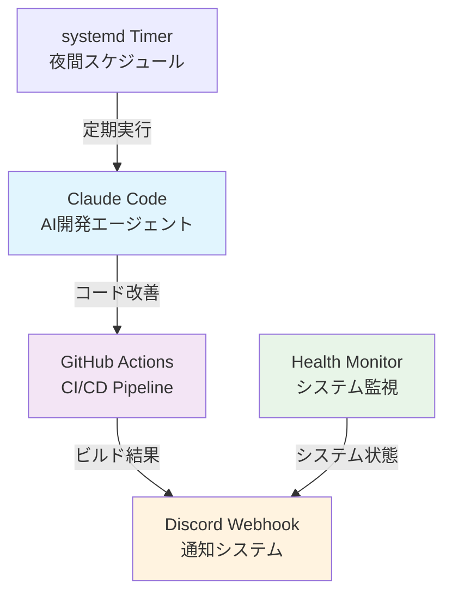

# Mihashi 自律開発システム設計書

## 概要

Mihashi Dev Project の自律開発システムは、GhostPC が Claude Code を活用して夜間時間帯（24:00-05:00）に Mihashi デバイスのコード改善・テスト・デプロイを自動実行するシステムです。systemd サービスとして稼働し、GitHub Actions と連携して Mihashi の継続的な開発を行います。

---

## システムアーキテクチャ



---

## 稼働スケジュール

### 実行時間帯
- **開始時刻**: 毎日 24:00 (JST)
- **終了時刻**: 毎日 05:00 (JST)  
- **実行間隔**: 30分毎
- **最大連続実行**: 10サイクル

### スケジュール設定

```bash
# systemd timer 設定
# /etc/systemd/system/autonomous-dev.timer
[Unit]
Description=Autonomous Development Timer
Requires=autonomous-dev.service

[Timer]
OnCalendar=*-*-* 00,00:30,01,01:30,02,02:30,03,03:30,04,04:30
Persistent=true

[Install]
WantedBy=timers.target
```

---

## Claude Code 統合

### AI開発エージェント設定

```python
class AutonomousDeveloper:
    def __init__(self, config):
        self.claude_client = anthropic.Anthropic(api_key=config.api_key)
        self.rate_limiter = TokenBucket(capacity=100, refill_rate=5)
        self.project_context = ProjectContext()
        
    def development_cycle(self):
        """1回の開発サイクル実行"""
        try:
            # プロジェクト状態分析
            context = self.analyze_project_state()
            
            # Claude による改善提案
            improvements = self.request_claude_improvements(context)
            
            # 改善実装
            changes = self.implement_improvements(improvements)
            
            # テスト実行
            test_results = self.run_tests()
            
            # 結果のコミット
            if test_results.passed:
                self.commit_changes(changes)
                
            return OperationResult(success=True, changes=changes)
            
        except Exception as e:
            self.handle_error(e)
            return OperationResult(success=False, error=str(e))
```

### プロンプト設計

```python
class ClaudePrompts:
    
    @staticmethod
    def code_review_prompt(code_context):
        return f"""
        Mihashi USB MIDI Host デバイスのファームウェア開発コードレビューと改善を実行してください。

        ## 現在の Mihashi コード状況:
        {code_context.current_files}

        ## 最近のコミット:
        {code_context.recent_commits}

        ## Mihashi テスト結果:
        {code_context.test_results}

        ## Mihashi 改善要求:
        1. USB PIO Host パフォーマンス最適化
        2. MIDI変換エラーハンドリング強化  
        3. RP2350A 最適化とコード可読性向上
        4. メモリ使用量削減（520KB SRAM 制約内）

        Mihashi デバイス用の改善提案と具体的なコード変更を提示してください。
        """
    
    @staticmethod
    def bug_fix_prompt(error_context):
        return f"""
        以下のエラーを解析し、修正方法を提案してください。

        ## エラー情報:
        {error_context.error_message}
        
        ## スタックトレース:
        {error_context.stack_trace}
        
        ## 関連コード:
        {error_context.related_code}
        
        根本原因の分析と修正コードを提供してください。
        """
```

---

## GitHub Actions 連携

### 自動CI/CDパイプライン

```yaml
# .github/workflows/autonomous-development.yml
name: Autonomous Development Workflow

on:
  push:
    branches: [ autobot ]
  schedule:
    - cron: '0 0 * * *'  # 毎日深夜実行

jobs:
  autonomous-development:
    runs-on: self-hosted
    environment: production
    
    steps:
    - name: Checkout Repository
      uses: actions/checkout@v4
      with:
        fetch-depth: 0
        
    - name: Setup Development Environment
      run: |
        export PICO_SDK_PATH=$HOME/pico-sdk
        cmake --version
        arm-none-eabi-gcc --version
        
    - name: Run Autonomous Development
      env:
        CLAUDE_API_KEY: ${{ secrets.CLAUDE_API_KEY }}
        DISCORD_WEBHOOK: ${{ secrets.DISCORD_WEBHOOK }}
      run: |
        python scripts/autonomous_dev/main.py
        
    - name: Build Firmware
      run: |
        cd firmware/mihashi
        mkdir -p build && cd build
        cmake ..
        make -j4
        
    - name: Run Tests
      run: |
        cd firmware/mihashi/build
        ctest --output-on-failure
        
    - name: Deploy Artifacts
      if: success()
      run: |
        python scripts/deploy/upload_firmware.py
        
    - name: Notify Results
      if: always()
      run: |
        python scripts/notifications/discord_notify.py \
          --status ${{ job.status }} \
          --commit ${{ github.sha }}
```

---

## 通知システム

### Discord Webhook 統合

```python
class DiscordNotifier:
    def __init__(self, webhook_url):
        self.webhook_url = webhook_url
        
    def send_development_report(self, cycle_result):
        """開発サイクル結果を通知"""
        embed = {
            "title": "🤖 自律開発レポート",
            "description": f"開発サイクル完了: {cycle_result.timestamp}",
            "color": 0x00ff00 if cycle_result.success else 0xff0000,
            "fields": [
                {
                    "name": "改善項目",
                    "value": f"{len(cycle_result.improvements)}件",
                    "inline": True
                },
                {
                    "name": "テスト結果", 
                    "value": f"{cycle_result.tests_passed}/{cycle_result.total_tests}",
                    "inline": True
                },
                {
                    "name": "処理時間",
                    "value": f"{cycle_result.duration:.1f}秒",
                    "inline": True
                }
            ]
        }
        
        if cycle_result.changes:
            embed["fields"].append({
                "name": "主な変更",
                "value": "\\n".join(cycle_result.changes[:5]),
                "inline": False
            })
            
        self._send_webhook({"embeds": [embed]})
    
    def send_error_alert(self, error_info):
        """エラー警告を送信"""
        embed = {
            "title": "⚠️ 自律開発エラー",
            "description": f"エラーが発生しました: {error_info.timestamp}",
            "color": 0xff0000,
            "fields": [
                {
                    "name": "エラータイプ",
                    "value": error_info.error_type,
                    "inline": True
                },
                {
                    "name": "エラーメッセージ",
                    "value": error_info.message[:500],
                    "inline": False
                }
            ]
        }
        self._send_webhook({"embeds": [embed]})
```

---

## システム監視

### ヘルスモニタリング

```python
class SystemHealthMonitor:
    def __init__(self):
        self.metrics_collector = MetricsCollector()
        self.alert_thresholds = {
            'cpu_usage': 80.0,
            'memory_usage': 85.0,
            'disk_usage': 90.0,
            'error_rate': 5.0
        }
    
    def collect_system_metrics(self):
        """システムメトリクス収集"""
        return {
            'cpu_percent': psutil.cpu_percent(interval=1),
            'memory_percent': psutil.virtual_memory().percent,
            'disk_percent': psutil.disk_usage('/').percent,
            'load_average': os.getloadavg()[0],
            'process_count': len(psutil.pids()),
            'network_io': psutil.net_io_counters()._asdict(),
            'timestamp': datetime.now().isoformat()
        }
    
    def check_health_status(self, metrics):
        """ヘルス状態チェック"""
        alerts = []
        
        for metric, threshold in self.alert_thresholds.items():
            if metric in metrics and metrics[metric] > threshold:
                alerts.append({
                    'metric': metric,
                    'value': metrics[metric],
                    'threshold': threshold,
                    'severity': 'warning' if metrics[metric] < threshold * 1.1 else 'critical'
                })
        
        return HealthStatus(
            healthy=len(alerts) == 0,
            alerts=alerts,
            metrics=metrics
        )
```

### ログ管理

```python
class AutonomousLogger:
    def __init__(self, log_dir="/var/log/autonomous-dev"):
        self.log_dir = Path(log_dir)
        self.log_dir.mkdir(exist_ok=True)
        
        # ローテーティングログハンドラ
        self.logger = logging.getLogger('autonomous-dev')
        handler = RotatingFileHandler(
            self.log_dir / 'autonomous-dev.log',
            maxBytes=10*1024*1024,  # 10MB
            backupCount=5
        )
        
        formatter = logging.Formatter(
            '%(asctime)s - %(name)s - %(levelname)s - %(message)s'
        )
        handler.setFormatter(formatter)
        self.logger.addHandler(handler)
        self.logger.setLevel(logging.INFO)
    
    def log_development_cycle(self, cycle_id, phase, data):
        """開発サイクルログ"""
        self.logger.info(f"Cycle {cycle_id} - {phase}: {json.dumps(data)}")
        
    def log_error(self, error, context=None):
        """エラーログ"""
        error_data = {
            'error': str(error),
            'type': type(error).__name__,
            'traceback': traceback.format_exc(),
            'context': context or {}
        }
        self.logger.error(f"Error occurred: {json.dumps(error_data)}")
```

---

## セキュリティ設定

### API キー管理

```bash
# 環境変数設定
export CLAUDE_API_KEY="sk-ant-..."
export DISCORD_WEBHOOK_URL="https://discord.com/api/webhooks/..."
export GITHUB_TOKEN="ghp_..."

# systemd service 環境変数
# /etc/systemd/system/autonomous-dev.service
[Service]
EnvironmentFile=/etc/autonomous-dev/environment
User=autonomous-dev
Group=autonomous-dev
```

### アクセス制御

```python
class SecurityManager:
    def __init__(self):
        self.allowed_operations = {
            'code_modification',
            'test_execution', 
            'documentation_update',
            'performance_optimization'
        }
        
        self.restricted_files = {
            '/etc/passwd',
            '/etc/shadow',
            '*.key',
            '*.pem'
        }
    
    def validate_operation(self, operation_type, target_files):
        """操作の安全性検証"""
        if operation_type not in self.allowed_operations:
            raise SecurityError(f"Operation {operation_type} not allowed")
            
        for file_path in target_files:
            if any(fnmatch.fnmatch(file_path, pattern) 
                   for pattern in self.restricted_files):
                raise SecurityError(f"Access to {file_path} denied")
                
        return True
```

---

## 運用手順

### 初期設定

```bash
# サービス有効化
sudo systemctl enable autonomous-dev.timer
sudo systemctl start autonomous-dev.timer

# 状態確認
sudo systemctl status autonomous-dev.timer
sudo journalctl -u autonomous-dev.service -f
```

### 監視コマンド

```bash
# ログ監視
tail -f /var/log/autonomous-dev/autonomous-dev.log

# システム状態確認
python scripts/monitoring/system_status.py

# Discord通知テスト
python scripts/notifications/test_discord.py
```

### 緊急停止

```bash
# サービス停止
sudo systemctl stop autonomous-dev.timer
sudo systemctl stop autonomous-dev.service

# 自動実行無効化
sudo systemctl disable autonomous-dev.timer
```

---

## パフォーマンス指標

### 目標値
- **サイクル実行時間**: < 5分
- **Claude API レスポンス**: < 30秒
- **ビルド時間**: < 2分
- **テスト実行時間**: < 1分
- **システム負荷**: CPU < 50%, Memory < 70%

### 監視メトリクス
- API使用量・レート制限
- エラー発生率
- 改善提案実装率
- テスト合格率
- システムリソース使用率

---

**最終更新**: 2025-06-24  
**稼働環境**: GhostPC (Ubuntu 22.04)  
**AI エージェント**: Claude-3.5 Sonnet  
**実行時間**: 毎日 24:00-05:00  
**開発対象**: Mihashi USB MIDI Host デバイス